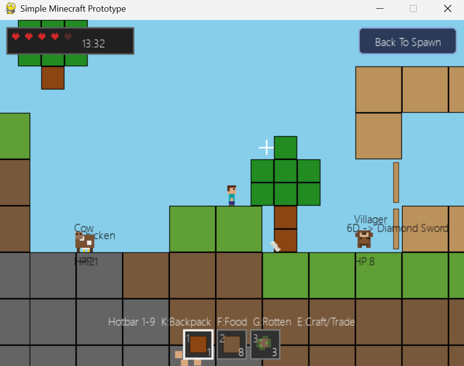

# Minecraft9

This is a Python version of Minecraft that I made when I was nine years old, inspired by Minor Cut on Scratch. It is a 2D game, and I first got help from my father. The whole program was made by me with ChatGPT 5.4.

## Overview

`Minecraft9` is a 2D sandbox survival prototype built with Python and `pygame`. The project focuses on recreating the feeling of Minecraft in a side-view world with mining, animals, combat, item collection, crafting, village life, and Nether exploration.

## Core Gameplay

- Move through a side-scrolling block world with gravity, jumping, swimming, and camera follow.
- Aim with a mouse-controlled crosshair and interact with animals, terrain, trees, and structures.
- Mine blocks such as dirt, stone, ores, wood, and other materials to collect resources.
- Pick up drops automatically when the player touches them.
- Eat food to recover health and survive hostile encounters.

## World Features

- Procedurally generated terrain with grass, dirt, stone, trees, rivers, coastline, ocean, and islands.
- A day and night cycle with changing sky colors and darkness overlays.
- Water and lava interactions inside the world.
- A Nether dimension with its own terrain, sky colors, lava danger, Piglins, and portal travel.
- Ruined portal generation and Nether portal activation.

## Creatures And NPCs

- Passive animals such as sheep, cows, chickens, and fish.
- Hostile mobs such as zombies and skeletons.
- Piglins in the Nether.
- Villagers with trading options.
- Iron golems that protect the village area.
- Creature behaviors include walking, turning at obstacles, basic jumping, daytime burning for some hostile mobs, drowning, ranged attacks, and respawning.

## Combat And Survival

- Left click attacks the target under the crosshair.
- Animals and enemies have health and can drop items when defeated.
- Skeletons can fire arrows at the player.
- The player has HP and must recover by consuming food.
- Lava, fire, hostile mobs, and environmental hazards can damage the player.
- A respawn flow is included after death.

## Items, Crafting, And Progression

- Collect wood, dirt, stone, meat, ores, ingots, planks, obsidian, and more.
- Use a hotbar and backpack system to manage items.
- Craft workbenches, furnaces, pickaxes, swords, and building materials.
- Smelt iron ore and gold ore in a furnace using coal as fuel.
- Upgrade through multiple tool tiers including wood, stone, iron, gold, diamond, and redstone tools.
- Tool durability and attack speed are part of progression.

## Trading

- Villagers trade diamonds for useful items.
- Piglins can trade in the Nether.
- Trading is integrated into the main survival loop alongside mining and combat.

## Controls

- `A` / `D` or `Left` / `Right`: move
- `W`, `Space`, or `Up`: jump
- `S` or `Down`: move downward in suitable situations
- Mouse: aim the crosshair
- Left click: attack or mine depending on the target
- `F`: eat food and restore HP
- `E`: craft, trade, or place and interact with workbench-related systems
- `K`: open or close the backpack
- `1` to `9`: select hotbar slots

## Technical Notes

- Main game file: `source/main.py`
- Asset folder: `image/`
- Image paths are resolved relative to the project now, so the game can run after moving the folder to another location.
- The project is written in Python and uses `pygame`.

## Current Status

- The project is a playable prototype.
- The main loop already includes movement, combat, mining, drops, inventory management, crafting, trading, villages, and Nether travel.
- The codebase is large and feature-rich for a personal childhood project, and it shows an ambitious attempt to build a Minecraft-like experience in 2D.
